# Configuración del Entorno de Desarrollo

Para poder escribir código que pueda ser interpretado por un lenguaje de programación, necesitamos utilizar un editor de texto.

## Visual Studio Code

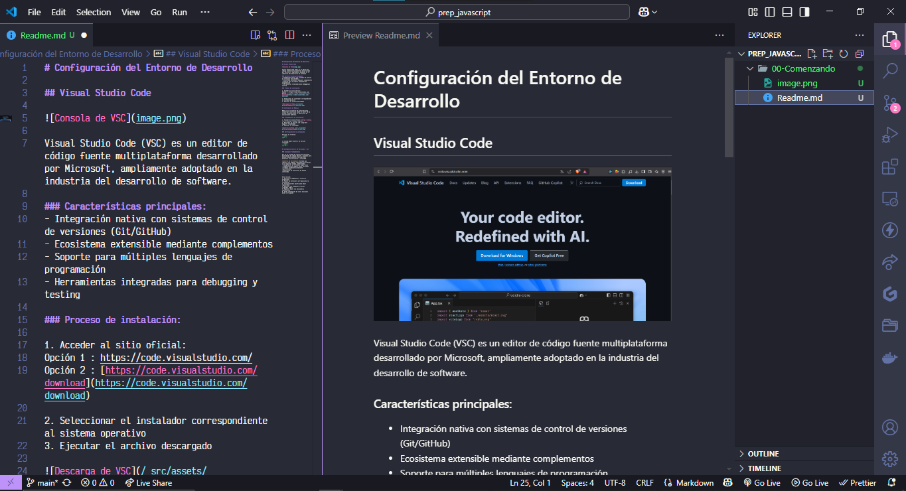  

Visual Studio Code (VSC) es un editor de código fuente multiplataforma desarrollado por Microsoft, ampliamente adoptado en la industria del desarrollo de software.

### Características principales:
- Integración nativa con sistemas de control de versiones (Git/GitHub)
- Ecosistema extensible mediante complementos
- Soporte para múltiples lenguajes de programación
- Herramientas integradas para debugging y testing

### Proceso de instalación:

1. Acceder al sitio oficial:   
Opción 1 : https://code.visualstudio.com/    
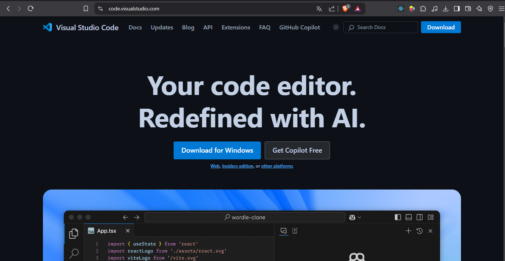      

2. Opción 2 : [https://code.visualstudio.com/download](https://code.visualstudio.com/download)     

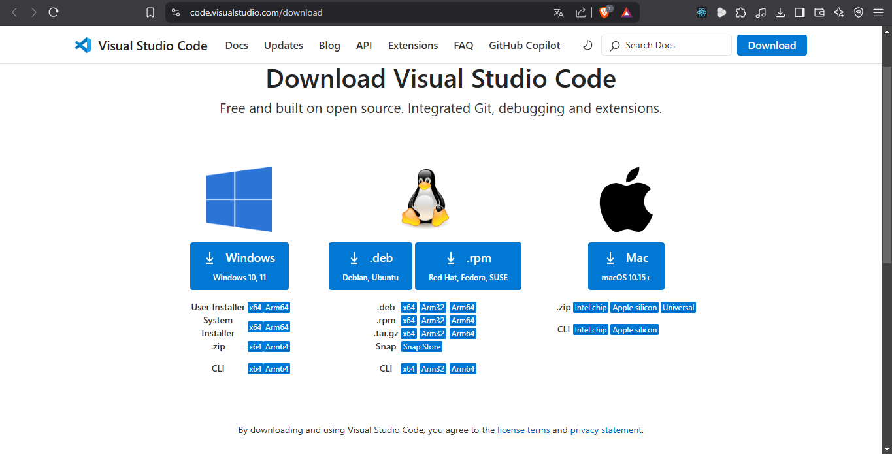


3. Seleccionar el instalador correspondiente al sistema operativo.   

4. Ejecutar el archivo descargado.


## Instalación de Node.js

Node.js es un entorno de ejecución para JavaScript construido sobre el motor V8 de Chrome, esencial para el desarrollo de aplicaciones modernas.

### Procedimiento de instalación:

1. Visitar el sitio oficial: [https://nodejs.org/es/](https://nodejs.org/es/)   

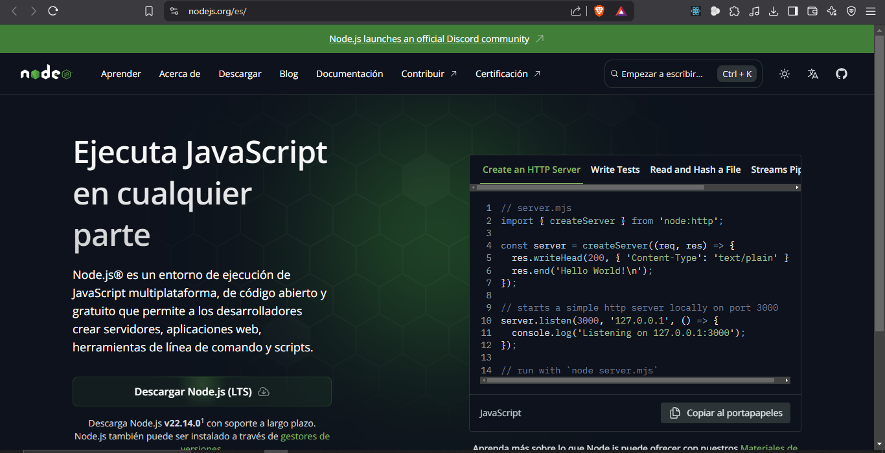   

2. Descargar la versión LTS (Long-Term Support) recomendada
3. Ejecutar el instalador


### Verificación de la instalación:

Ejecutar en terminal:
```shell
node -v
```

La salida deberá mostrar la versión instalada:
```shell
v22.14.0
```

## Sistema de Control de Versiones - Git

### Conceptos fundamentales

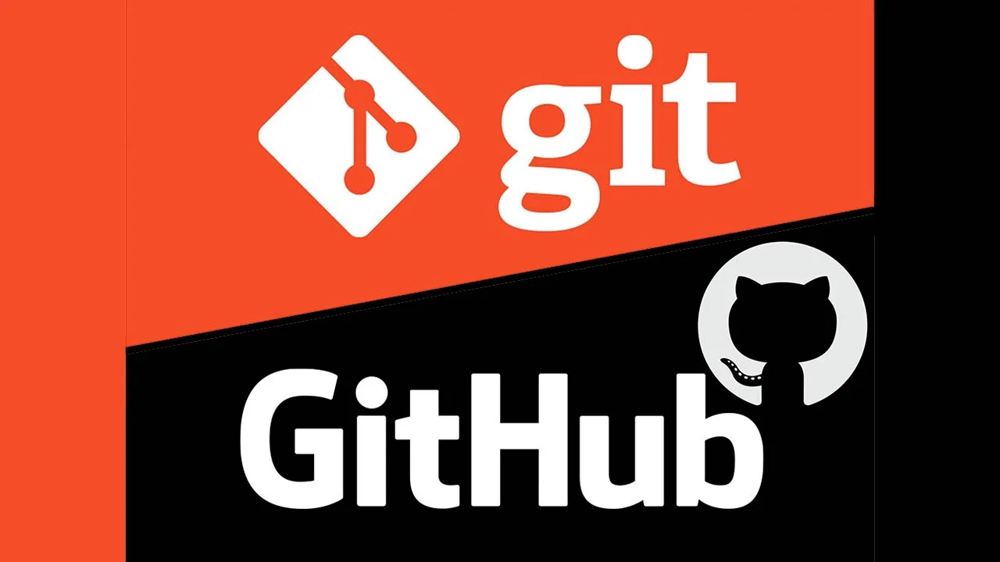

Git es un sistema de control de versiones distribuido de código abierto, diseñado para manejar desde pequeños hasta grandes proyectos con eficiencia y velocidad.

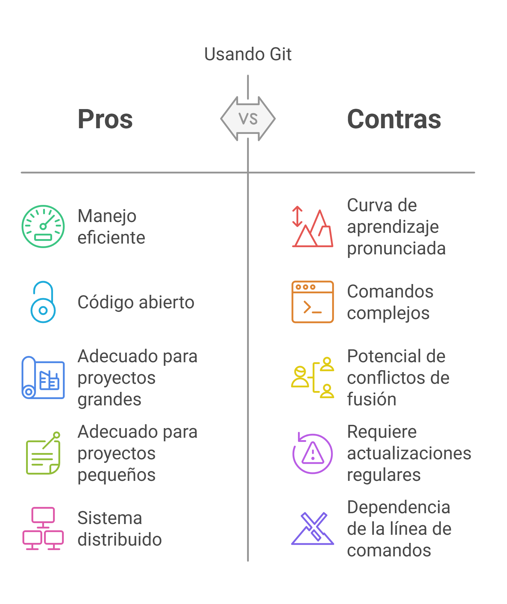

**Control de versiones**: Sistema que registra los cambios realizados en archivos a lo largo del tiempo, permitiendo:
- Recuperación de versiones específicas
- Comparación de cambios entre versiones
- Trabajo colaborativo mediante ramificaciones
- Resolución de conflictos de manera controlada

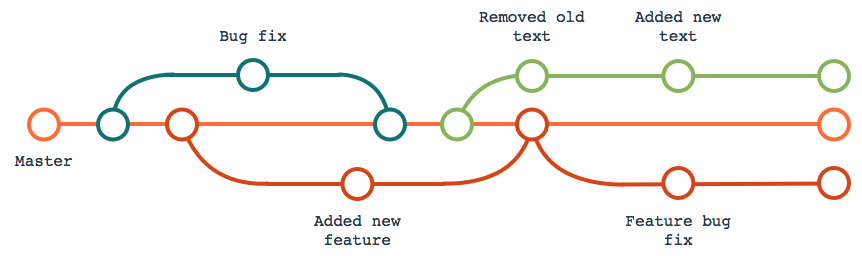

---

# Instalación de Git en Windows

## Descarga e instalación

1. Accede al sitio oficial de Git: [https://git-scm.com](https://git-scm.com)
2. Descarga la última versión estable para Windows (actualmente 2.45.1)
3. Ejecuta el archivo .exe descargado

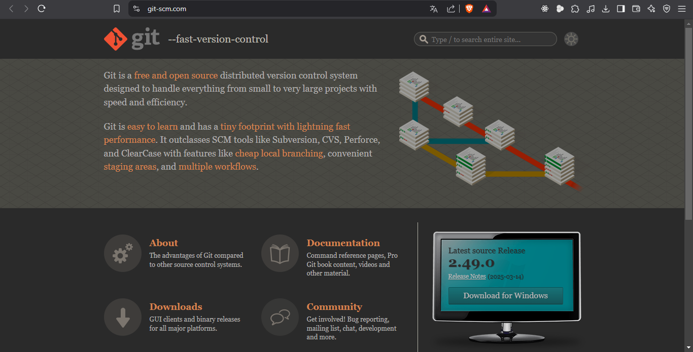

## Proceso de instalación

### Configuración inicial
Al iniciar el instalador, seguir estos pasos:

1. Acepta los términos de licencia
2. Selecciona las opciones por defecto hasta llegar a la configuración del editor

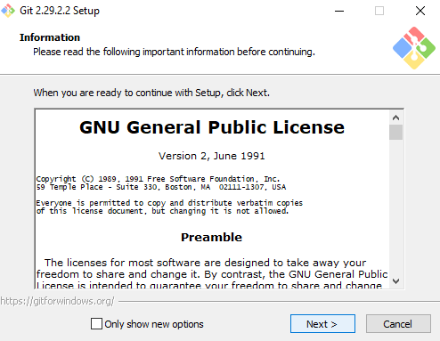

**Recomendación:** Selecciona tu editor de código preferido (asegúrate de tenerlo instalado previamente)

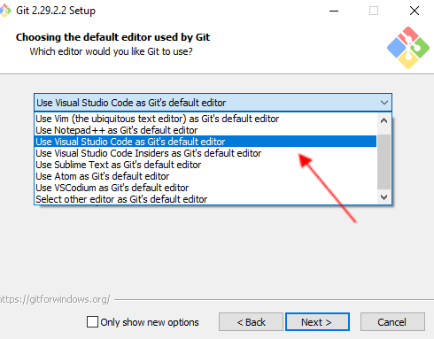


### Finalización
1. Completa el proceso haciendo clic en "Install"
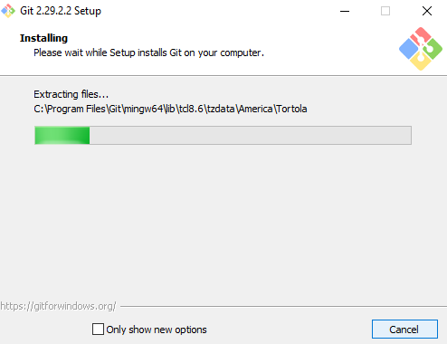     
2. Marca la opción "Launch Git Bash" para abrir la terminal inmediatamente

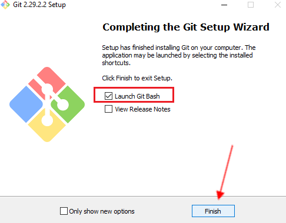  

## Verificación

Puedes acceder a Git Bash de dos formas:
1. Desde el menú de inicio
2. Haciendo clic derecho en cualquier carpeta y seleccionando "Git Bash Here"

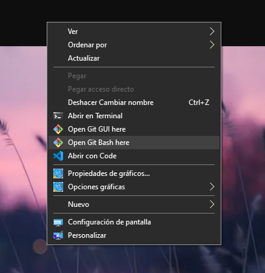

Para confirmar la instalación correcta, ejecuta:
```bash
git --version
```

Deberás ver la versión instalada:
```bash
git version 2.44.0.windows.1
```


**Nota:** La versión mostrada puede variar según la última actualización disponible.   

Al abrirla debería verse similar a esto:


--- 

## ¿ Qué es GitHub ?   
### **GitHub: Plataforma de Desarrollo Colaborativo**  

GitHub es una **plataforma de alojamiento de repositorios Git** basada en la nube, diseñada para facilitar el control de versiones y la colaboración en proyectos de desarrollo de software.  

### **Características principales**  
✔ **Almacenamiento en la nube:** Permite guardar y administrar repositorios Git de forma remota.  
✔ **Trabajo colaborativo:** Facilita el desarrollo en equipo mediante *forks*, *pull requests* y *code reviews*.  
✔ **Portafolio profesional:** Los repositorios públicos sirven como evidencia de experiencia en programación.  
✔ **Integración con Git:** Aunque **GitHub no es lo mismo que Git**, funciona como un complemento esencial para proyectos que utilizan este sistema de control de versiones.  

### **GitHub vs. Git**  
| **Git** | **GitHub** |  
|---------|------------|  
| Sistema de control de versiones *local* | Plataforma *remota* para alojar repositorios Git |  
| Se ejecuta en tu computadora | Servicio en la nube con interfaz web |  
| Gestiona el historial de cambios | Ofrece herramientas adicionales (Issues, Actions, Wikis) |  


### **Beneficios clave**  
🔹 **Open Source:** Ideal para contribuir a proyectos públicos.  
🔹 **CI/CD Integrado:** Soporte para GitHub Actions y despliegues automatizados.  
🔹 **Comunidad global:** Acceso a millones de repositorios y desarrolladores.  

**Nota:** Existen alternativas como GitLab y Bitbucket, pero GitHub sigue siendo el servicio más adoptado en la industria.  

---  
**Versión mejorada:**  
✅ Más profesional y detallada  
✅ Estructura clara con bullets y tabla comparativa  
✅ Lenguaje técnico pero accesible  
✅ Elimina redundancias y mejora el flujo de lectura

### Comenzando

1. Para comenzar nos creamos una cuenta --- > <https://github.com> 🚀

 

Hacemos click en `Sign up` y se despliega la siguiente pantalla

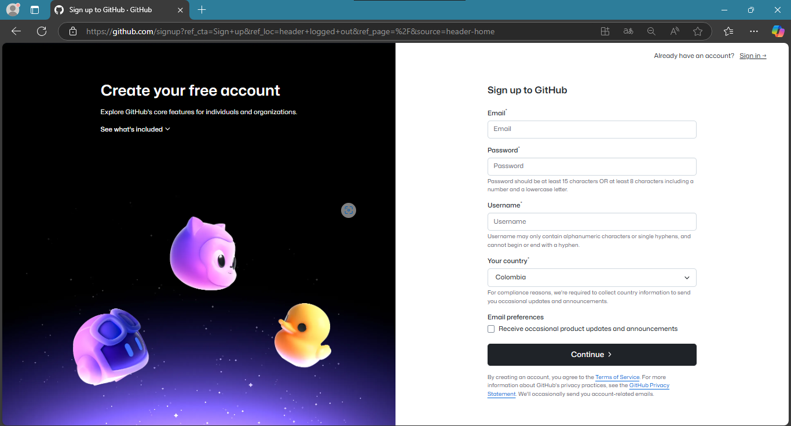


2. Una vez registrados, ingresamos con usuario y contraseña:

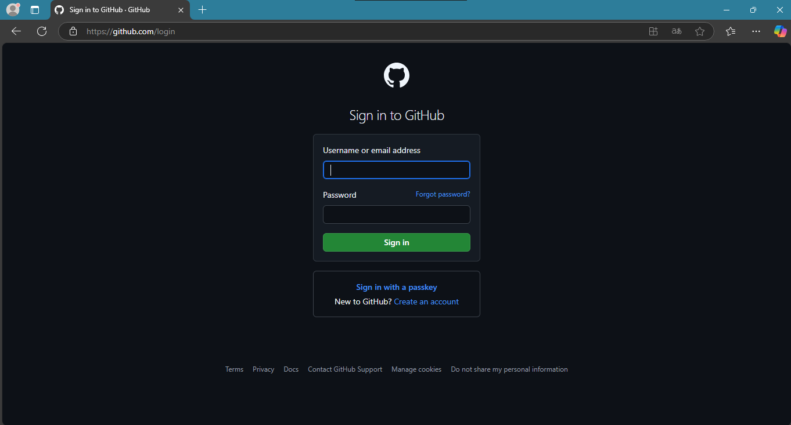

3. Listo! Ahora vemos una página de inicio como la siguiente:

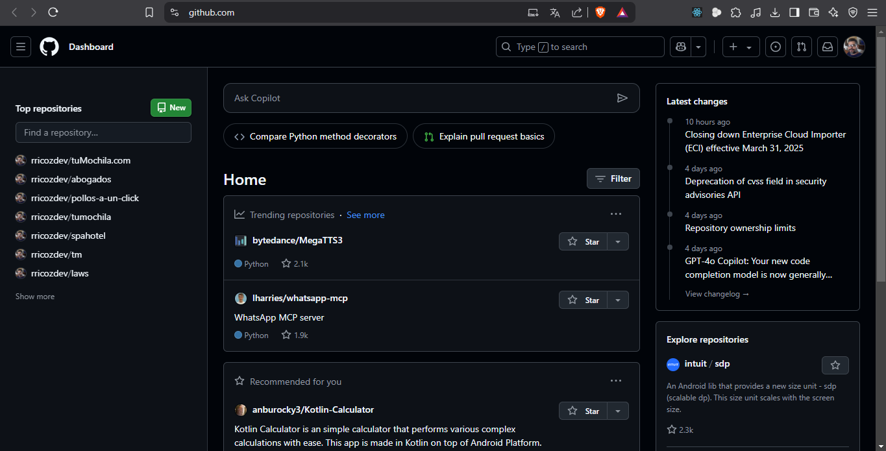


**Navegando por la interfaz de GitHub:**

1. **Panel izquierdo - Tus repositorios**  
   Acceso rápido a todos tus proyectos almacenados en GitHub.

2. **Centro - Actividad reciente**  
   Muestra las últimas actualizaciones de los desarrolladores que sigues, como nuevos commits o proyectos.

3. **Esquina superior derecha - Tu perfil**  
   - Haz clic en tu foto para ver:
     * Tu cuenta y configuración
     * Tus repositorios
     * Opciones de administración
   - Al entrar a tu perfil, verás una página similar a esta:

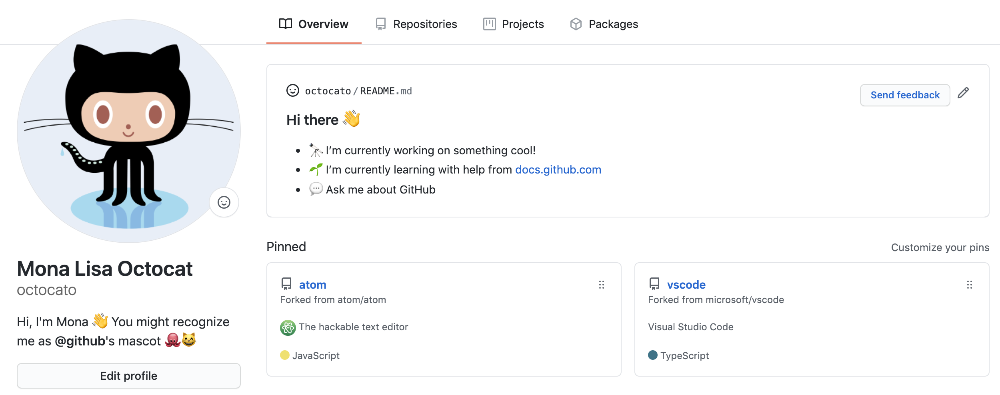
