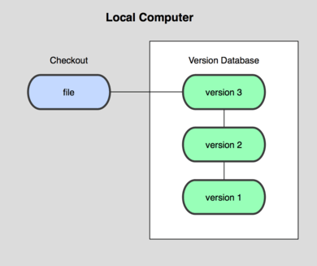
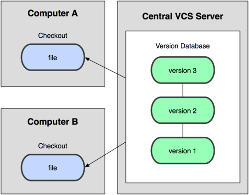
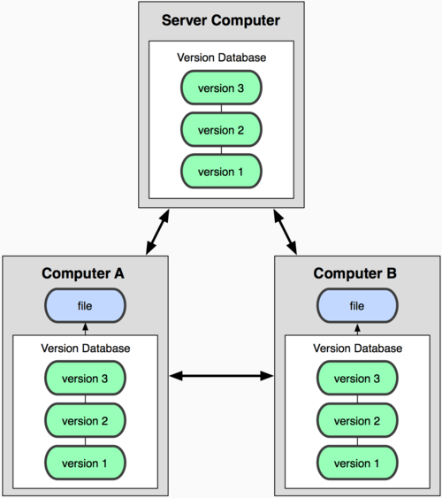
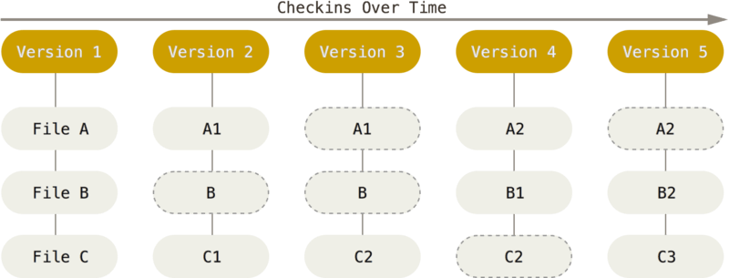
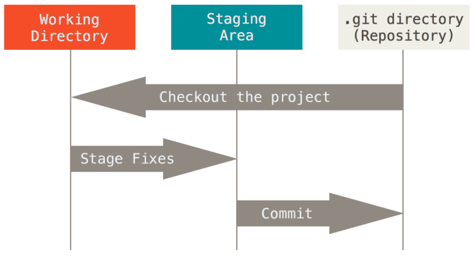

# Uso de Git


---

## Version Control System  

### ¿Qué es un control de versiones y por qué es importante?  

Un **sistema de control de versiones** (**VCS**, por sus siglas en inglés) es una herramienta que registra los cambios realizados en un archivo o conjunto de archivos a lo largo del tiempo. Esto permite recuperar versiones anteriores cuando sea necesario, facilitando la gestión de proyectos y evitando la pérdida de información.  

Si trabajas como **diseñador gráfico, desarrollador web o programador**, un VCS te ayudará a gestionar versiones de tus archivos de manera eficiente. Con un sistema de control de versiones, puedes:  

- Restaurar archivos o proyectos completos a un estado anterior.  
- Comparar cambios a lo largo del tiempo.  
- Identificar quién realizó una modificación específica y cuándo.  
- Localizar el origen de errores en el código o en los archivos.  
- Evitar la pérdida de datos, ya que puedes recuperar archivos eliminados o dañados fácilmente.  

El uso de un VCS no solo mejora la organización del trabajo, sino que también permite la colaboración eficiente en equipo, ya que varios usuarios pueden contribuir al mismo proyecto sin sobrescribir accidentalmente el trabajo de otros.  

### Tipos de sistemas de control de versiones  

Existen varios tipos de sistemas de control de versiones, que se clasifican en:  

### **1. Control de versiones local**  

El control de versiones local es el método más simple para gestionar cambios en archivos. Consiste en almacenar diferentes versiones de un archivo en el mismo equipo sin la necesidad de un servidor central o repositorios remotos.

#### ¿Cómo funciona?      

El usuario guarda múltiples copias del mismo archivo en distintas carpetas o con nombres diferentes (por ejemplo, proyecto_v1.docx, proyecto_v2.docx, proyecto_final.docx). Sin embargo, este enfoque manual puede volverse caótico y propenso a errores, ya que es difícil rastrear qué versión es la más actualizada y qué cambios se realizaron en cada una.



Para mejorar esta gestión, se crearon herramientas especializadas de control de versiones locales, como RCS (Revision Control System), que almacena los cambios de los archivos en una base de datos dentro del mismo equipo.

#### Desventajas del control de versiones local   

- Riesgo de pérdida de datos: Si el equipo se daña o se pierde, todas las versiones pueden desaparecer.

- Falta de colaboración: Solo una persona puede trabajar con los archivos, lo que dificulta la cooperación en equipo.

- Dificultad para rastrear cambios: Es complicado identificar qué modificaciones se hicieron y cuándo.

Debido a estas limitaciones, la mayoría de los desarrolladores y diseñadores prefieren usar sistemas de control de versiones centralizados o distribuidos, como Git, que permiten un mejor manejo de proyectos en equipo y copias de seguridad seguras.   


### **2. Control de versiones centralizado**  



El **control de versiones centralizado** se basa en un modelo donde un único servidor almacena todas las versiones del proyecto, y los usuarios descargan y suben los cambios desde y hacia ese servidor.  

#### **¿Cómo funciona?**  
- Existe un **servidor central** que contiene el historial completo de versiones del proyecto.  
- Los usuarios deben conectarse al servidor para obtener la versión más reciente de los archivos y enviar sus cambios.  
- Cada vez que un usuario hace una modificación, debe "enviar" (commit + push) los cambios al servidor para que queden registrados y accesibles para otros colaboradores.  

#### **Ejemplos de sistemas de control de versiones centralizados:**  
- **CVS (Concurrent Versions System)**  
- **Subversion (SVN)**  
- **Perforce**  

#### **Ventajas del control de versiones centralizado**  
✅ **Mejor gestión en equipo**: Todos los colaboradores acceden a la misma fuente de verdad, evitando conflictos entre versiones.  
✅ **Historial completo en un solo lugar**: Se pueden rastrear todos los cambios desde el servidor central.  
✅ **Mayor control**: Los administradores pueden gestionar permisos de acceso para los usuarios.  

#### **Desventajas del control de versiones centralizado**  
❌ **Dependencia del servidor**: Si el servidor central falla o se corrompe, se puede perder todo el historial del proyecto.  
❌ **Acceso constante a internet**: Se requiere conexión al servidor para trabajar o realizar cambios, lo que puede ser un problema en entornos sin internet.  
❌ **Mayor carga en el servidor**: A medida que crece el proyecto y la cantidad de colaboradores, el rendimiento del servidor puede verse afectado.  

---

### **¿Por qué han sido reemplazados en muchos casos?**  
Los sistemas de control de versiones centralizados fueron ampliamente utilizados en el pasado, pero con el tiempo, las **desventajas como la dependencia del servidor y la falta de trabajo offline** llevaron a la adopción de **sistemas de control de versiones distribuidos**, como **Git**, que ofrecen mayor flexibilidad y seguridad.  

--- 

### **3. Control de versiones distribuido**  



El **control de versiones distribuido (DVCS - Distributed Version Control System)** es una evolución del modelo centralizado. En este enfoque, cada usuario tiene una copia completa del historial del proyecto en su máquina, lo que permite trabajar sin depender de un servidor central.  

#### **¿Cómo funciona?**  
- En lugar de depender de un único servidor, **cada clon del repositorio es una copia exacta de todo el historial del proyecto**.  
- Los usuarios pueden realizar cambios localmente (commits) sin necesidad de estar conectados a internet.  
- Una vez que los cambios están listos, los usuarios pueden sincronizar su versión con otros repositorios remotos a través de `push` y `pull`.  
- Si el servidor remoto falla, cualquier usuario con una copia completa del repositorio puede restaurarlo.  

#### **Ejemplos de sistemas de control de versiones distribuidos:**  
- **Git** (el más popular, usado en plataformas como GitHub, GitLab y Bitbucket)  
- **Mercurial (Hg)**  
- **Bazaar**  

#### **Ventajas del control de versiones distribuido**  
✅ **Trabajo offline**: Se pueden realizar commits, ver el historial y gestionar cambios sin conexión a internet.  
✅ **Mayor seguridad**: Como cada usuario tiene una copia completa del proyecto, el riesgo de perder datos por un fallo en el servidor es mucho menor.  
✅ **Colaboración más eficiente**: Permite la creación de ramas (`branches`) para trabajar en características o correcciones sin afectar el código principal.  
✅ **Mejor rendimiento**: Las operaciones locales (como commits y revisiones de historial) son rápidas, ya que no dependen de un servidor remoto.  

#### **Desventajas del control de versiones distribuido**  
❌ **Curva de aprendizaje**: Herramientas como Git pueden ser más complejas para usuarios principiantes en comparación con sistemas centralizados.  
❌ **Mayor uso de almacenamiento**: Almacenar todo el historial del proyecto en cada máquina puede ocupar más espacio en disco, aunque en la mayoría de los casos esto no es un problema grave.  

---

### **¿Por qué Git se ha convertido en el estándar?**  
Git ha dominado el mundo del desarrollo de software porque combina lo mejor del control de versiones distribuido con una gran flexibilidad y velocidad. Además, plataformas como **GitHub, GitLab y Bitbucket** han facilitado la colaboración en proyectos de código abierto y privados.  

---
Aquí tienes la versión mejorada y actualizada de tu texto:  

---

## **Historia de Git**  

Como muchas innovaciones tecnológicas, **Git** nació de una necesidad urgente y un conflicto dentro de la comunidad de desarrollo de Linux.  

El núcleo de **Linux**, uno de los proyectos de software de código abierto más grandes del mundo, manejó durante años sus cambios mediante el intercambio de **parches y archivos**. Sin embargo, en 2002, decidieron adoptar un **sistema de control de versiones distribuido (DVCS) propietario llamado BitKeeper**.  

Todo funcionó hasta 2005, cuando la relación entre la comunidad de desarrollo de Linux y la empresa que mantenía **BitKeeper** se rompió, lo que llevó a la revocación de su uso gratuito. Ante esta situación, la comunidad de Linux, liderada por **Linus Torvalds** (creador de Linux), decidió desarrollar su propia herramienta de control de versiones, tomando como referencia lo aprendido con BitKeeper.  

### **Objetivos de Git desde su creación**  
El diseño de Git se centró en cumplir con estos principios clave:  

- **Alta velocidad** en las operaciones de versionado.  
- **Estructura simple y eficiente**.  
- **Soporte sólido para desarrollo no lineal**, permitiendo gestionar miles de ramas simultáneamente.  
- **Modelo completamente distribuido**, sin necesidad de depender de un servidor central.  
- **Capacidad de manejar grandes proyectos**, como el propio núcleo de Linux, optimizando tanto el espacio como el rendimiento.  

Desde su lanzamiento en **2005**, Git ha evolucionado para convertirse en la herramienta estándar de control de versiones en el mundo del desarrollo de software. Su diseño lo hace **rápido, eficiente y altamente escalable**, con un potente sistema de **ramificación (branching)** que permite un desarrollo flexible y no lineal.  

---

## **Conceptos de Git**  



Git maneja los datos de una forma distinta a otros sistemas de control de versiones. En lugar de almacenar cambios como una secuencia de diferencias entre versiones, **Git trata cada versión como una instantánea completa del proyecto en un momento específico**.  

Cada vez que confirmas un cambio (**commit**), Git guarda una **captura del estado actual de todos los archivos** y la almacena en su historial.  

Para optimizar el almacenamiento, si un archivo no ha cambiado entre versiones, Git no lo duplica, sino que crea un **enlace a la versión anterior del mismo archivo**. Esto hace que Git sea extremadamente eficiente en términos de espacio y velocidad.  

---

Aquí tienes la versión mejorada y actualizada del texto:  

---

## **Integridad en Git**  

Una de las características clave de **Git** es su enfoque en la **integridad de los datos**.  

Cada archivo y cada cambio son verificados mediante una **suma de comprobación** (**checksum** en inglés) antes de ser almacenados. Esto garantiza que **cualquier modificación en un archivo o directorio sea detectada de inmediato**.  

### **SHA-1: El mecanismo de seguridad de Git**  

Git utiliza el algoritmo **SHA-1 (Secure Hash Algorithm 1)** para generar identificadores únicos de 40 caracteres hexadecimales, basados en el contenido del archivo o estructura de directorios.  

Ejemplo de un hash SHA-1 en Git:  

```shell
24b9da6552252987aa493b52f8696cd6d3b00373
```  

Estos valores hash aparecen en muchos aspectos de Git, ya que Git **no almacena archivos por su nombre, sino por el valor hash de su contenido**. Esto garantiza que cualquier cambio en un archivo se detecte inmediatamente, protegiendo la integridad del proyecto.  

---

## **Estructura de Git: Directorios y Estados**  

Git organiza su información en dos áreas principales:  

1. **Directorio de Git (`.git/`)**: Es el núcleo del sistema. Contiene todos los metadatos del repositorio y la base de datos comprimida con el historial de cambios.  
2. **Directorio de trabajo**: Es una versión descomprimida del proyecto donde puedes ver y modificar los archivos.  

Cada archivo dentro del **directorio de trabajo** puede encontrarse en uno de los siguientes **estados**:  

### **Estados en Git**    



🔹 **Committed**: El archivo ya ha sido guardado de forma segura en la base de datos local de Git.  
🔹 **Modified**: El archivo ha sido editado, pero los cambios aún no han sido guardados en el historial de Git.  
🔹 **Staged**: El archivo ha sido marcado para ser incluido en el próximo commit.  

Estos estados permiten un flujo de trabajo flexible y controlado, asegurando que cada cambio sea registrado de manera precisa antes de ser almacenado definitivamente en el historial del proyecto.  

---

## **GitHub: La plataforma de repositorios más popular**  

[**GitHub**](https://github.com) es una plataforma en línea para almacenar y gestionar repositorios de código. En esencia, es un **repositorio de repositorios**, lo que permite a los desarrolladores colaborar, compartir y administrar sus proyectos.  

Es importante destacar que **Git y GitHub no son lo mismo** (**Git ≠ GitHub**). Git es un **sistema de control de versiones**, mientras que GitHub es una plataforma basada en la nube que facilita el almacenamiento, la colaboración y la distribución de repositorios Git.  

### **¿Por qué usar GitHub?**  
✅ **Colaboración**: Permite trabajar en equipo de manera eficiente, gestionando contribuciones y revisiones de código.  
✅ **Portafolio profesional**: Es un excelente lugar para mostrar tus proyectos y contribuciones a la comunidad.  
✅ **Código abierto y aprendizaje**: Puedes encontrar y contribuir a proyectos de código abierto, aprendiendo de otros desarrolladores.  
✅ **Integraciones**: Compatible con múltiples herramientas de desarrollo, facilitando la automatización y la gestión de proyectos.  

Si quieres ser desarrollador, **tener una cuenta en GitHub es esencial**. Durante tu formación en Henry, utilizaremos GitHub de manera intensiva para gestionar y compartir código.  

---

## **Lecturas recomendadas**  

📖 [**Git - Sitio oficial**](https://git-scm.com/)  
📖 [**GitHub - Tutorial oficial**](https://try.github.io/levels/1/challenges/1)  
📖 [**Git - Tutorial oficial**](https://git-scm.com/docs/gittutorial)  
📖 [**Tutorial de la terminal**](https://www.davidbaumgold.com/tutorials/command-line/)  

---

## **Homework**  

Completa la tarea descrita en el archivo [README](./Homework/Readme.md) en la carpeta Homework de esta clase. 🚀


