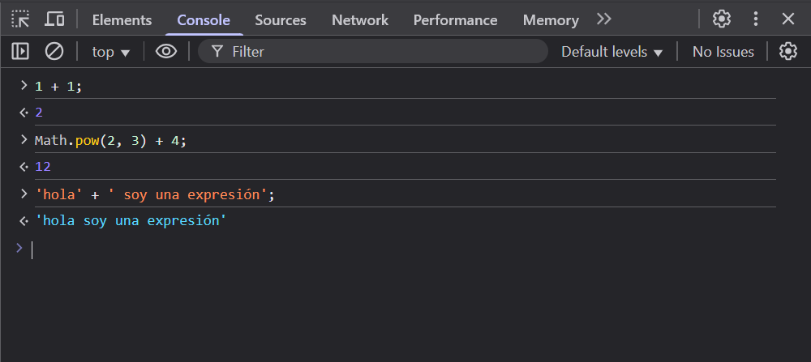
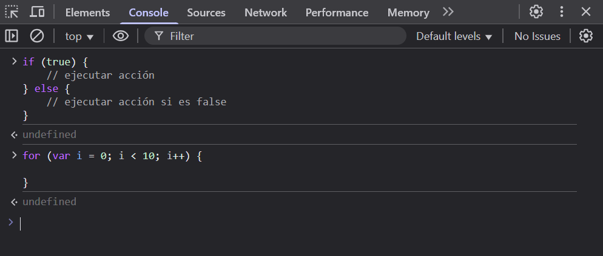

# Conceptos Fundamentales de JavaScript

#### Expresiones vs Sentencias

En JavaScript, todo el código que escribimos puede clasificarse en dos categorías fundamentales: **expresiones** (expressions) y **sentencias** (statements). La diferencia clave es:

- Una **expresión** produce (retorna) un valor
- Una **sentencia** realiza una acción

Aunque en la práctica combinamos ambos tipos constantemente, entender su diferencia es crucial para escribir código efectivo. Veamos ejemplos:

```javascript
// Ejemplos de expresiones (retornan valores)
1 + 1
Math.pow(2, 3) + 4
'hola' + ' soy una expresión'
```

Al evaluar estas expresiones en la consola del navegador, obtenemos inmediatamente su resultado:



```javascript
// Ejemplo de sentencia (realiza una acción)
if (condicion) {
  // código ejecutado si es verdadero
} else {
  // código ejecutado si es falso
}
```

Las sentencias no producen un valor directo al evaluarlas en la consola:



> **Regla práctica**: Si puedes colocarlo dentro de un `console.log()`, es una expresión. Si no, es una sentencia.
> Ejemplo:
> ```javascript
> // Expresiones válidas en console.log
> console.log(1 + 1);
> console.log(Math.pow(2,3) + 22);
> 
> // Sentencia inválida en console.log
> console.log(if(true) { /* código */ }); // Error
> ```

> **Pregunta**: ¿El operador ternario (`condición ? valor1 : valor2`) es una expresión o sentencia?

## Tipos de Expresiones

Las expresiones pueden clasificarse en varias categorías según su función:

### 1. Expresiones Aritméticas
Producen valores numéricos:
```javascript
10;
1 + 10;
2 * 16;
```

### 2. Expresiones de Cadenas
Producen valores de texto:
```javascript
'hola';
'hola' + ' como estás?';
```

### 3. Expresiones Lógicas
Producen valores booleanos:
```javascript
10 > 9;
11 === 2;
false;
```

### 4. Expresiones Primarias
Expresiones básicas sin operadores:
```javascript
'hola';
23;
true;
this;    // Referencia al contexto
variable; // Referencia a una variable
```

### 5. Expresiones de Asignación
Utilizan el operador `=` y retornan el valor asignado:
```javascript
a = 1;        // Retorna 1
let c = (a = 2); // c contiene 2
```

> **Nota**: Las declaraciones con `let`/`const` retornan `undefined`, a diferencia de las asignaciones simples.

### 6. Expresiones con Efectos Secundarios
Retornan un valor pero también modifican el estado:
```javascript
contador++;   // Retorna valor e incrementa
++contador;   // Incrementa y retorna valor
mult *= 2;    // Multiplica, asigna y retorna
```

## Tipos de Sentencias

Las sentencias se clasifican según su función en el programa:

### 1. Sentencias de Declaración
Crean variables o funciones:
```javascript
let prueba;
const PI = 3.14;

function suma(a, b) {
  return a + b;
}
```

#### Expresiones vs Declaraciones de Funciones
JavaScript diferencia entre:
```javascript
// Declaración de función (statement)
function resta(a, b) {
  return a - b;
}

// Expresión de función
const resta = function(a, b) {
  return a - b;
};

// Uso en callbacks (siempre son expresiones)
array.map(function(item) {
  return item * 2;
});

// IIFE (Immediately Invoked Function Expression)
(function() {
  console.log('Función autoinvocada');
})();
```

### 2. Sentencias Condicionales
Controlan el flujo de ejecución:
```javascript
if (condicion) {
  // código si verdadero
} else if (otraCondicion) {
  // código alternativo
} else {
  // código por defecto
}
```

### 3. Bucles y Saltos
Manejan repetición y control de flujo:
```javascript
// Bucles
while (condicion) {
  // código repetido
}

for (let i = 0; i < 10; i++) {
  // código iterativo
}

// Saltos
function ejemplo() {
  return; // Termina la ejecución
  // Código inalcanzable
}

for (let i = 0; i < 10; i++) {
  if (i === 5) continue; // Salta iteración
  if (i === 8) break;    // Termina bucle
}

throw new Error('Mensaje de error');
```

### 4. Sentencias-Expresión
Casos donde JavaScript permite expresiones como sentencias:
```javascript
// Expresión como sentencia
a = 1 + 2;
llamadaAFuncion();
```

> **Regla importante**: Donde se espera una sentencia puedes usar una expresión, pero no viceversa.

## Conclusión

Software Labs enfatiza la importancia de dominar estas diferencias para:

1. Escribir código más limpio y predecible
2. Entender mejor el flujo de ejecución
3. Utilizar correctamente funciones y expresiones
4. Evitar errores comunes en estructuras de control

La práctica constante de estos conceptos es fundamental para convertirse en un desarrollador JavaScript competente.